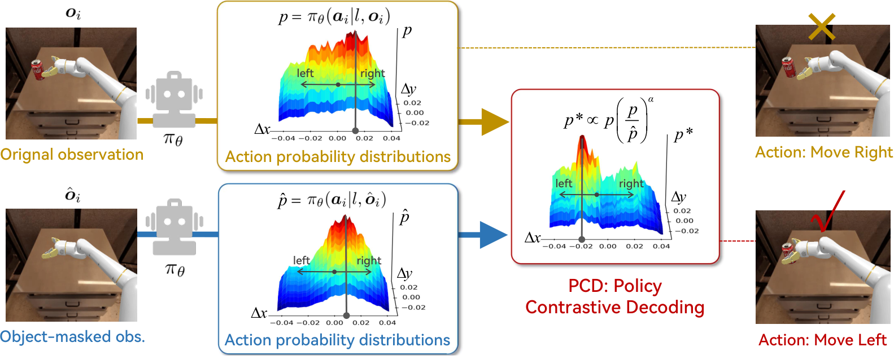

# Policy Contrastive Decoding for Robotic Foundation Models

[[Project]](https://Koorye.github.io/proj/PCD/) [[ArXiv]](https://arxiv.org/abs/2505.13255) [[PDF]](https://arxiv.org/pdf/2505.13255)

Official implementation of the paper "[Policy Contrastive Decoding for Robotic Foundation Models](https://arxiv.org/abs/2505.13255)".

> **Note**: We are doing our best to improve this work. If you have any questions or suggestions, please feel free to create an issue in this repo or contact us at shihan.wu.koorye@outlook.com.

## News

- 🔥**May 23, 2025**: Our paper has been updated for **better clarity and readability**. The optimized version is now available on arXiv.
- 🔥**May 20, 2025**: The code is released and the paper is now available on arXiv.

## Introduction

> **Abstract** Generalist robot policies, or robotic foundation models, hold immense potential to enable flexible, general-purpose and dexterous robotic systems. Despite their advancements, our empirical experiments reveal that existing robot policies are prone to learning spurious correlations from pre-training trajectories, adversely affecting their generalization capabilities during inference. To tackle this, we propose a novel **Policy Contrastive Decoding (PCD)** approach, which redirects the robot policy’s focus toward object-relevant visual clues by contrasting action probability distributions derived from original and object-masked visual inputs. As a training-free method, our PCD can be used as a *plugin* to improve different types of robot policies without needing to finetune or access model weights. We conduct extensive experiments on top of three open-source robot policies, including the autoregressive policy **OpenVLA** and the diffusion-based policies **Octo** and $\pi_0$. The obtained results in both simulation and real-world environments prove PCD’s flexibility and effectiveness, e.g., PCD enhances the state-of-the-art policy $\pi_0$ by **8%** in the simulation environment and by **108%** in the real-world environment.



## Experiments

### Overall Performance

**Simulated Environments**


**Real-world Environments**


### Performance on Different Factors


## Videos

### Real-world Environments

**Baseline**

| Pick Ball | Move Near | Banana Plate | Stack Cube |
| :-------: | :-------: | :---------: | :-------: |
|  |  |  |  |
| **Distractors** | **Spatial Relation** | **Brightness** | **Texture** |
|  |  |  |  |

**+PCD**

| Pick Ball | Move Near | Banana Plate | Stack Cube |
| :-------: | :-------: | :---------: | :-------: |
|  |  |  |  |
| **Distractors** | **Spatial Relation** | **Brightness** | **Texture** |
|  |  |  |  |

### Simulated Environments

**Baseline**

| Pick Coke Can | Move Near | Carrot Plate | Eggplant Basket |
| :-----------: | :-------: | :---------: | :-------: |
|  |  |  |  |
| **Spatial Relation** | **Brightness** | **Texture** | **Texture** |
|  |  |  |  |

**+PCD**

| Pick Coke Can | Move Near | Carrot Plate | Eggplant Basket |
| :-----------: | :-------: | :---------: | :-------: |
|  |  |  |  |
| **Spatial Relation** | **Brightness** | **Texture** | **Texture** |
|  |  |  |  |

## Running

1. Clone this repository.

```bash
git clone https://github.com/pcd-robot/PCD.git
```

2. Install all dependencies.

```bash
conda create -n pcd python=3.10
conda activate pcd
bash scripts/install_dependencies.sh
```

3. Running evaluation on simpler.

```bash
bash scripts/default/run.sh
```

## Acknowledgements

Our work is built upon the following open-source projects: [SimplerEnv](https://github.com/simpler-env/SimplerEnv), [OpenVLA](https://github.com/openvla/openvla), [Octo](https://github.com/octo-models/octo), [Open Pi-0](https://github.com/allenzren/open-pi-zero), [Grounded SAM2](https://github.com/IDEA-Research/Grounded-SAM-2), [YOLO World](https://github.com/AILab-CVC/YOLO-World), [SED](https://github.com/xb534/SED), [Inpaint Anything](https://github.com/geekyutao/Inpaint-Anything).
We thank the authors for releasing their code. If you use our model and code, please consider citing these works as well.